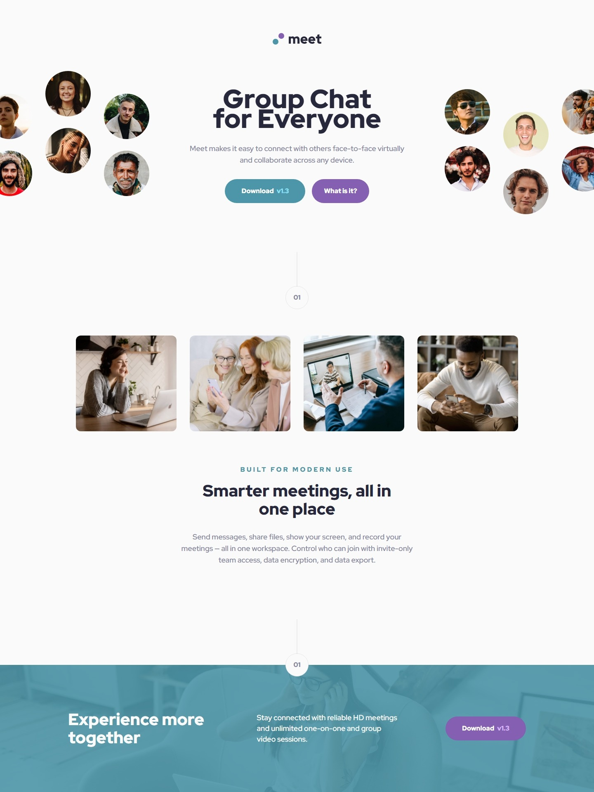

# Frontend Mentor - Meet landing page solution

This is a solution to the [Meet landing page challenge on Frontend Mentor](https://www.frontendmentor.io/challenges/meet-landing-page-rbTDS6OUR). Frontend Mentor challenges help you improve your coding skills by building realistic projects.

### Screenshot

### Links

- Solution URL: [Solution URL here](https://github.com/NDK1195/meet-landing-page)
- Live Site URL: [Live site URL here](https://ndk1195.github.io/meet-landing-page/)

### Built with

- HTML5
- Tailwind CSS
